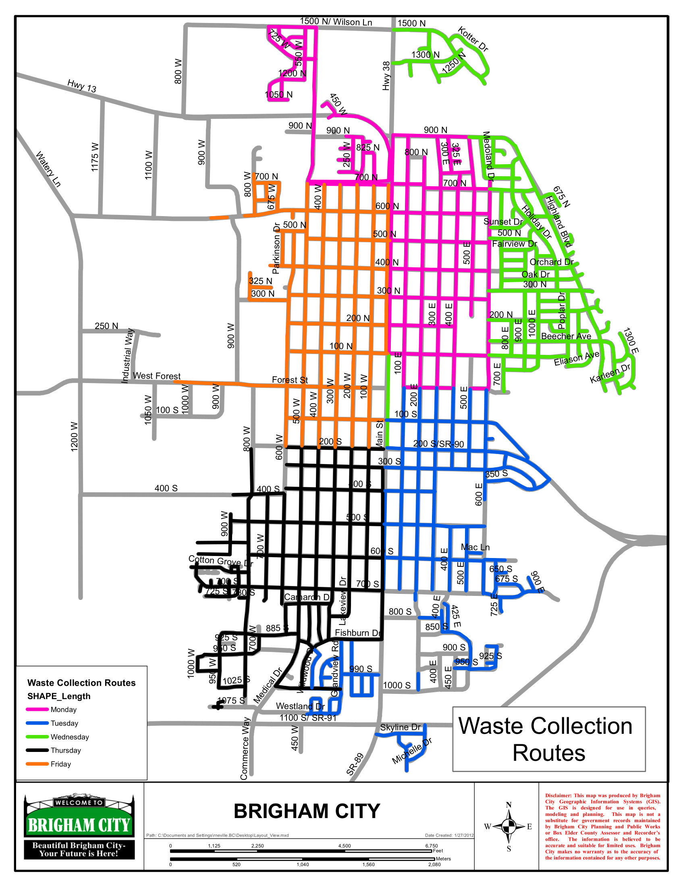

# Arc Routing Problems

**Arc Routing problems** are kind of  *routing problems* that finds routes covering streets and roads.

>Example include 
- Postal deliveries
 - Residential waste collection

	
